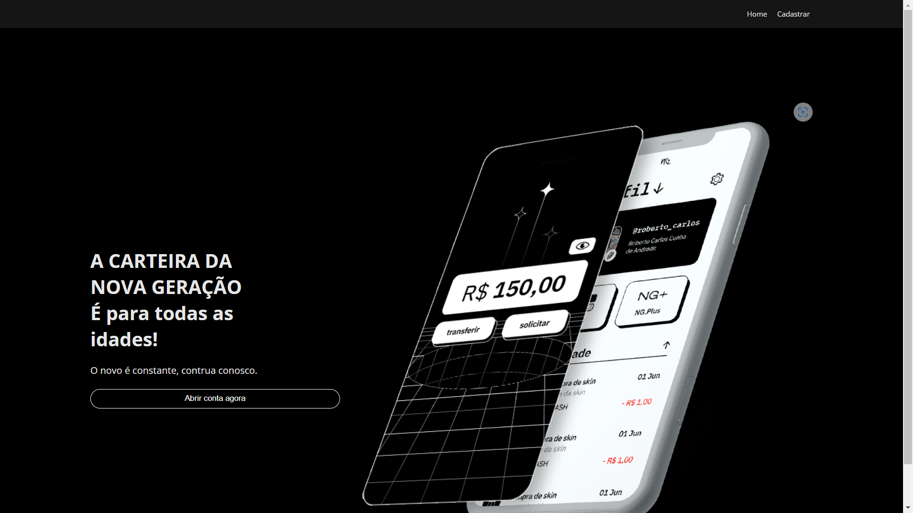

<h1 align="center"> NG.CASH </h1>

Projeto desenvolvido por Carlos Cerqueira para o processo seletivo da NG Cash

  <a href="#-tecnologias">Tecnologias</a>&nbsp;&nbsp;&nbsp;|&nbsp;&nbsp;&nbsp;
  <a href="#-projeto">Projeto</a>&nbsp;&nbsp;&nbsp;|&nbsp;&nbsp;&nbsp;
  <a href="#-layout">Layout</a>&nbsp;&nbsp;&nbsp;

 

  

## 🚀 Tecnologias

Esse projeto foi desenvolvido com as seguintes tecnologias:

- HTML e CSS
- React
- TypeScript
- Git e GitHub

## 💻 Projeto

- Página para realizar o cadastro na NG informando *username* e *password.*
- Página para realizar o login informando *username* e *password.*
- Com o usuário logado, a página principal apresenta:
- *balance* atual do usuário;
- Seção voltada à realização de transferências para outros usuários NG a partir do *username* de quem sofrerá o *cash-in*;
- Tabela com os detalhes de todas as transações que o usuário participou;
- Botão para realizar o *log-out.*

## 🔖 Layout

O layout foi baseado no site e app oficiais da empresa. Disponíveis em https://ng.cash/

---